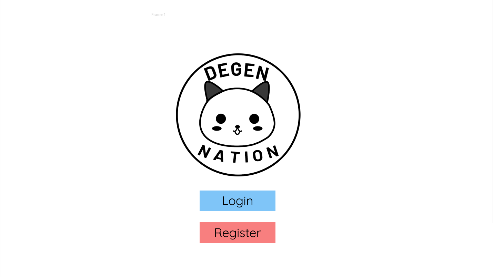
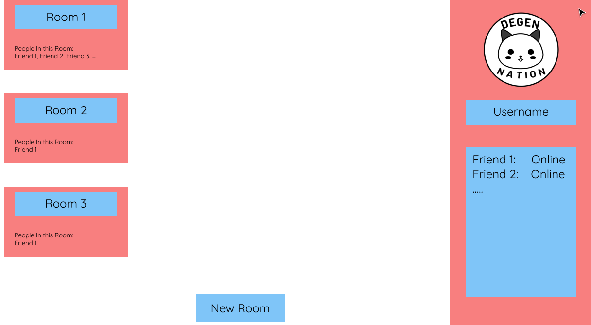
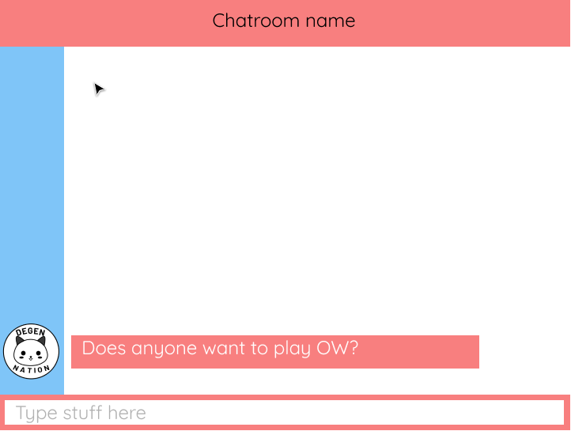

# Degen Chat 
#### Author: Phillip Tran

# Overview
This purpose of this app is to create a web chatting service. This means it is capable of the following:
* Allows users to create an account 
* Allows users to create and join chat rooms 
* Allows users to send messages and have that message be recieved by everybody in that room

This application should also have some form of redundancy. This means users should be able to always have their accounts, chatrooms, and messages avaliable to them, even in the case of a server failure. 

# Basic UI
The UI will be very minimalistic because I am terrible at design work. It'll mainly use the material theme because I am nothing if not a massive hipster and think the material theme looks best with a minimalistic UI

## UI Login Screen

## UI User Home Page

## UI Chat Room

# Languages
We will be using React w/ Typescript as a front end due to it's helpful communnity and long term support. It's also just my prefered thing to write web code with. We will use typescript to enforce static typing for more readability and reduce potential programmer-prone errors. I selected Go as a back end because I feel like due to the app's nature of multiple clients needing to talk to one another, we will have to use some form of concurrency, which Go excels at. Plus I'm nothing if not a massive hipster and shun node js for something that the other developers 'just don't understand man.' 

# Design 
We will be implimenting a RESTful api as our main form of client-server communication. The api will contain the following endpoints:
* Users
* Rooms

## Users
This endpoint will contain data about the User. It will look like this: 
{
    &nbsp;&nbsp;&nbsp;User: \<string> 
    &nbsp;&nbsp;&nbsp;ID: \<number>
    &nbsp;&nbsp;&nbsp;Rooms: \<Object>
} 
* <ins>User</ins>: Defines the username a given user chose
* <ins>ID</ins>: A special indentifier given to all users.
* <ins>Rooms</ins>: A collection of Room IDs belonging to the rooms the user created or joined

## Rooms 
This endpoint will contain data about a Room object. It will look like this:
{
    &nbsp;&nbsp;&nbsp;ID: \<string>
    &nbsp;&nbsp;&nbsp;Users: \<Object>
}
* <ins> ID </ins>: A special indentifier given to all rooms
* <ins> Users </ins>: A collection of User IDs belonging to all participants in a room

   
The two end points are bidirectional, meaning that for any room you can find all the users in it AND for every user you can find all rooms containing that user. This is done to reduce searching hassle, as users and rooms are closely connected in this app, so it'd be good to strongly link them together. 

# React Side
On the front-end here's how each component will work

## Login Component
This component will be in charge of handling the Login logic. It will display the UI elements and prompt the user to either Login or Register.
## Register
If the user selects register, the UI will prompt them for an Email and Password. After receiving both, the program will check to see if the user is already in our system using a GET request to the USERS endpoint. If the user is not in our system, the program will generate a unique identifier for that user and submit a POST request to the USERS endpoint adding the User. It will then (probably) write that User into some sort of database in order to perserve the data in the event of a server crash. If the user is in our system, we will throw an error and notify the user. Afterwards re-render this component to allow the user to select Login

## Login
If the user selects login, the UI will prompt the user again for an email and password. After recieving both it will submit a GET request to the USERS endpoint in order to verify the User is in our system. If the user is not in our system, throw an error and notify our user. Else if the user is in the system, proceed to the User Home Page Component.